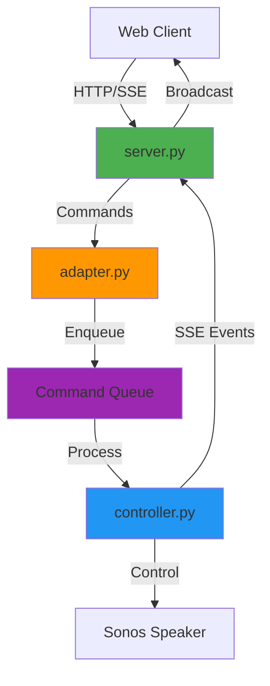
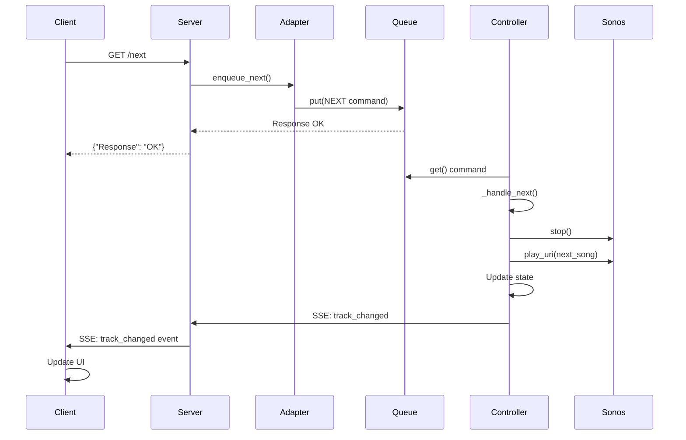
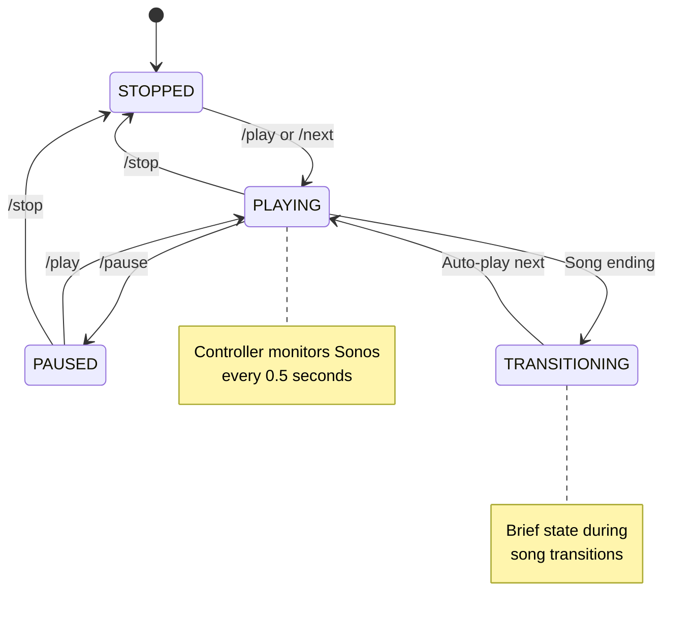
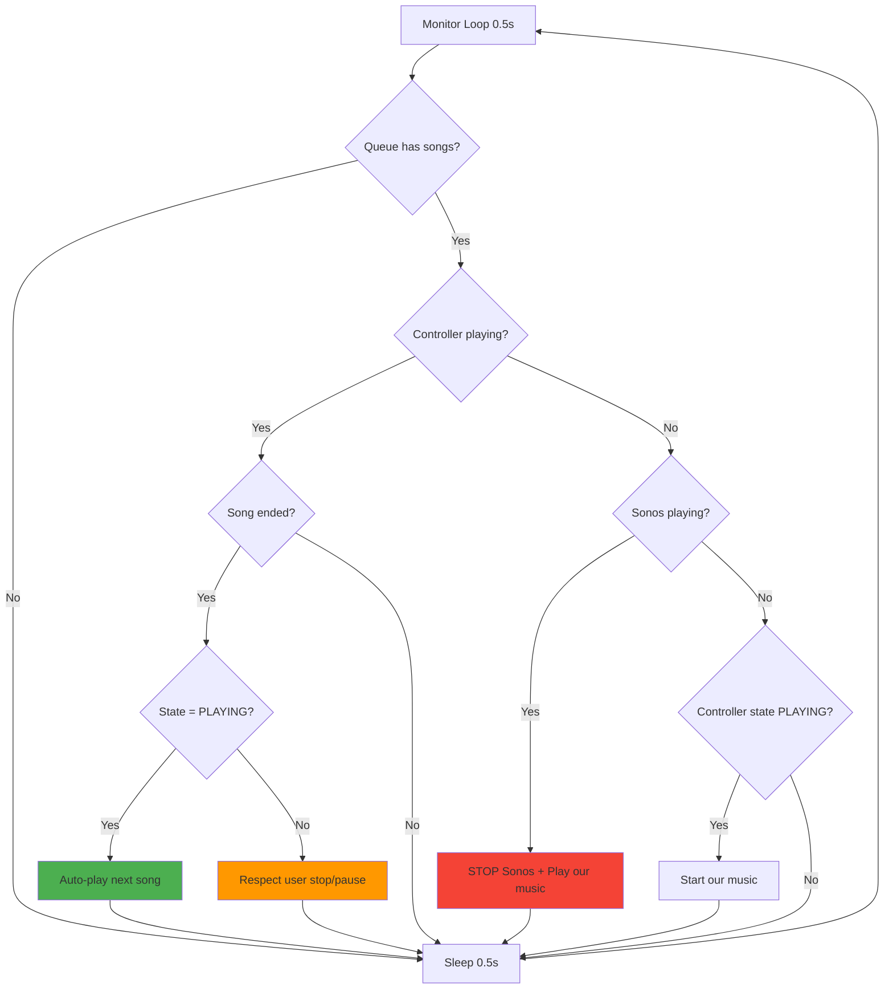

# TinySonos API Documentation

## Architecture Overview

TinySonos uses a command-queue architecture to eliminate race conditions and provide reliable, skip-free playback. The system is built with four main components:

### System Components



### Component Responsibilities

#### 1. **server.py** - HTTP Server & API Gateway
- Handles all HTTP requests from web clients
- Manages Server-Sent Events (SSE) for real-time updates
- Routes commands to the adapter when USE_NEW_CONTROLLER=true
- Falls back to legacy jukebox thread when USE_NEW_CONTROLLER=false
- Serves static web content and media files

#### 2. **adapter.py** - Backward Compatibility Bridge
- Provides a consistent API interface to server.py
- Translates high-level operations into Command objects
- Maintains compatibility with existing server endpoints
- Returns state information to server for HTTP responses

#### 3. **commands.py** - Command System
- Defines CommandType enum (PLAY, PAUSE, NEXT, ADD_SONG, etc.)
- Command class encapsulates operations with optional data
- CommandQueue provides thread-safe command processing

#### 4. **controller.py** - Playback Controller
- Single-threaded command processor (eliminates race conditions)
- Manages music queue and playback state internally
- Monitors Sonos hardware state (0.5s polling)
- Implements "hyper-aggressive" takeover from external sources
- Sends SSE callbacks when state changes

### Request Flow



### State Management Flow



### Monitoring & Takeover Logic



---

## API Endpoints

### Endpoint Summary

| Category | Endpoint | Description |
|----------|----------|-------------|
| **Server-Sent Events** | [GET /events](#get-events) | Subscribe to real-time server updates |
| **Playback Info** | [GET /current](#get-current) | Get currently playing track information |
| | [GET /location](#get-location) | Get current track location and state (includes sonos_state) |
| | [GET /state](#get-state) | Get playback state and queue information |
| | [GET /queuedepth](#get-queuedepth) | Get number of songs in queue |
| | [GET /playing](#get-playing) | Get currently playing song details |
| **Playback Controls** | [GET /play](#get-play) | Resume or start playback |
| | [GET /pause](#get-pause) | Pause playback |
| | [GET /stop](#get-stop) | Stop playback |
| | [GET /next](#get-next) | Skip to next song in queue |
| | [GET /prev](#get-prev) | Go to previous song (Sonos native) |
| | [GET /disconnect](#get-disconnect) | Disconnect from current Sonos speaker |
| **Volume Controls** | [GET /volume/{level}](#get-volumelevel) | Set volume to specific level (0-100) |
| | [GET /volumeup](#get-volumeup) | Increase volume by 5 |
| | [GET /volumedown](#get-volumedown) | Decrease volume by 5 |
| **Queue Management** | [GET /queue](#get-queue) | Get all songs in queue |
| | [GET /queue/clear](#get-queueclear) | Clear all songs from queue |
| **Playlist Operations** | [GET /playlists](#get-playlists) | List all available playlists |
| | [GET /showplaylist/{name}](#get-showplaylistname) | Get songs in a specific playlist |
| | [GET /playlist/{name}](#get-playlistname) | Load playlist into queue and start playing |
| **Song Operations** | [GET /addsong/{akey}/{skey}](#get-addsongakeyskey) | Add a single song to queue |
| | [GET /playfile/{path}](#get-playfilepath) | Play a file immediately by path |
| **Album Operations** | [GET /albums/recent](#get-albumsrecent) | Get recently added albums |
| | [GET /albums/all](#get-albumsall) | Get all albums in library |
| | [GET /albumlist/{filter}](#get-albumlistfilter) | Get filtered album list |
| | [GET /album/{id}](#get-albumid) | Get album details including all tracks |
| | [GET /albumadd/{id}](#get-albumaddid) | Add entire album to queue |
| **Speaker Management** | [GET /speakers](#get-speakers) | Get list of all Sonos speakers on network |
| | [GET /setzone/{ip}](#get-setzoneip) | Set active Sonos speaker/zone |
| | [GET /speaker_join/{ip}](#get-speaker_joinip) | Join speaker to current group |
| | [GET /speaker_unjoin/{ip}](#get-speaker_unjoinip) | Remove speaker from group |
| | [GET /speaker_vol/{ip}/{level}](#get-speaker_voliplevel) | Set volume for specific speaker |
| **Toggle Controls** | [GET /toggle/repeat](#get-togglerepeat) | Toggle repeat mode |
| | [GET /toggle/shuffle](#get-toggleshuffle) | Toggle shuffle mode |
| **System Information** | [GET /stats](#get-stats) | Get controller statistics (NEW CONTROLLER ONLY) |
| | [GET /sonos](#get-sonos) | Get active Sonos speaker information |
| | [GET /rescan](#get-rescan) | Reload music database |
| **Database Operations** | [GET /db](#get-db) | Get entire music database (for debugging) |
| | [GET /loaddb](#get-loaddb) | Reload database from disk |

---

### Server-Sent Events (SSE)

#### GET /events
Subscribe to real-time server updates.

**Response:** Event stream
```javascript
// Event types:
// - track_changed: New song started
// - playback_state: State changed (PLAYING/PAUSED/STOPPED)
// - queue_changed: Queue modified
// - volume_changed: Volume adjusted
```

**Example:**
```javascript
const eventSource = new EventSource('/events');
eventSource.addEventListener('track_changed', (e) => {
    const data = JSON.parse(e.data);
    console.log('Now playing:', data.title);
});
```

---

### Playback Information

#### GET /current
Get currently playing track information.

**Response:**
```json
{
    "title": "Song Title",
    "artist": "Artist Name",
    "album": "Album Name",
    "position": "0:01:23",
    "duration": "0:03:45",
    "state": "PLAYING",
    "album_art": "/album-art/abc123.png",
    "metadata": "<DIDL-Lite>...</DIDL-Lite>"
}
```

#### GET /location
Get current track location and state (includes sonos_state).

**Response:**
```json
{
    "title": "Song Title",
    "artist": "Artist Name",
    "album": "Album Name",
    "position": "0:01:23",
    "duration": "0:03:45",
    "state": "PLAYING",
    "sonos_state": "PLAYING",
    "album_art": "http://...",
    "uri": "http://...",
    "metadata": "<DIDL-Lite>...</DIDL-Lite>"
}
```

**Note:** `state` is TinySonos controller state, `sonos_state` is actual Sonos hardware state. When they differ, an external source (Alexa, Apple Music) is controlling the speaker.

#### GET /state
Get playback state and queue information.

**Response:**
```json
{
    "state": "PLAYING",
    "repeat": false,
    "shuffle": false,
    "queue_depth": 5
}
```

**States:**
- `PLAYING` - Actively playing music
- `PAUSED_PLAYBACK` - Paused
- `STOPPED` - Stopped
- `TRANSITIONING` - Brief state during song changes

#### GET /queuedepth
Get number of songs in queue.

**Response:**
```json
{
    "queuedepth": 5
}
```

#### GET /playing
Get currently playing song details.

**Response:**
```json
{
    "title": "Song Title",
    "artist": "Artist Name",
    "album": "Album Name",
    "path": "http://...",
    "album_art": "/album-art/abc123.png"
}
```

---

### Playback Controls

#### GET /play
Resume or start playback.

**Response:**
```json
{"Response": "OK"}
```

**Flow:**
- If queue has songs: Starts playing
- If nothing in queue: No action
- Sends `playback_state` SSE event

#### GET /pause
Pause playback.

**Response:**
```json
{"Response": "OK"}
```

#### GET /stop
Stop playback.

**Response:**
```json
{"Response": "OK"}
```

#### GET /next
Skip to next song in queue.

**Response:**
```json
{"Response": "OK"}
```

**Flow:**
1. Stops current playback
2. Pops next song from queue
3. Plays next song
4. Sends `track_changed` and `playback_state` SSE events

**Critical:** This endpoint was prone to race conditions in the legacy architecture. The command-queue pattern ensures songs never skip.

#### GET /prev
Go to previous song (Sonos native function).

**Response:**
```json
{"Response": "OK"}
```

**Note:** Uses Sonos's built-in previous functionality, not queue-based.

#### GET /disconnect
Disconnect from current Sonos speaker.

**Response:**
```json
{"Response": "OK"}
```

---

### Volume Controls

#### GET /volume/{level}
Set volume to specific level (0-100).

**Parameters:**
- `level` - Volume level (0-100)

**Example:** `/volume/50`

**Response:**
```json
{"Response": "OK"}
```

#### GET /volumeup
Increase volume by 5.

**Response:**
```json
{"Response": "OK"}
```

#### GET /volumedown
Decrease volume by 5.

**Response:**
```json
{"Response": "OK"}
```

---

### Queue Management

#### GET /queue
Get all songs in queue.

**Response:**
```json
{
    "queue": [
        {
            "title": "Song 1",
            "artist": "Artist 1",
            "album": "Album 1",
            "path": "http://...",
            "duration": "0:03:45"
        },
        ...
    ]
}
```

#### GET /queue/clear
Clear all songs from queue.

**Response:**
```json
{"Response": "OK"}
```

**Note:** Sends `queue_changed` SSE event.

---

### Playlist Operations

#### GET /playlists
List all available playlists.

**Response:**
```json
{
    "playlists": [
        {"name": "My Playlist.m3u8"},
        {"name": "Favorites.m3u8"}
    ]
}
```

**Alias:** `/listm3u`

#### GET /showplaylist/{name}
Get songs in a specific playlist.

**Parameters:**
- `name` - Playlist filename (URL encoded)

**Example:** `/showplaylist/My%20Playlist.m3u8`

**Response:**
```json
{
    "playlist": [
        {
            "title": "Song Title",
            "path": "/path/to/song.mp3"
        },
        ...
    ]
}
```

#### GET /playlist/{name}
Load playlist into queue and start playing.

**Parameters:**
- `name` - Playlist filename (URL encoded)

**Example:** `/playlist/Christmas.m3u8`

**Response:**
```json
{"Response": "OK"}
```

**Flow:**
1. Reads .m3u8 file
2. Adds all songs to queue
3. If queue was empty: Auto-starts playback
4. Sends `queue_changed` and potentially `track_changed` SSE events

---

### Song Operations

#### GET /addsong/{akey}/{skey}
Add a single song to queue.

**Parameters:**
- `akey` - Album key
- `skey` - Song key

**Example:** `/addsong/album123/song456`

**Response:**
```json
{"Response": "OK"}
```

**Flow:**
1. Looks up song in database
2. Adds to queue
3. If queue was empty: Auto-starts playback
4. Sends `queue_changed` SSE event

#### GET /playfile/{path}
Play a file immediately by path.

**Parameters:**
- `path` - URL-encoded file path (relative to media directory)

**Example:** `/playfile/Music%2FArtist%2FAlbum%2Fsong.mp3`

**Response:**
```json
{"Response": "OK"}
```

**Flow:**
1. Clears current queue
2. Adds song to queue
3. Plays immediately
4. Sends `queue_changed` and `track_changed` SSE events

---

### Album Operations

#### GET /albums/recent
Get recently added albums.

**Response:**
```json
{
    "albums": [
        {
            "id": "123",
            "title": "Album Title",
            "artist": "Artist Name",
            "key": "album123",
            "dateadded": "2024-01-15"
        },
        ...
    ]
}
```

**Note:** Limited to 100 most recent albums.

#### GET /albums/all
Get all albums in library.

**Response:**
```json
{
    "albums": [
        {
            "id": "123",
            "title": "Album Title",
            "artist": "Artist Name",
            "key": "album123"
        },
        ...
    ]
}
```

#### GET /albumlist/{filter}
Get filtered album list.

**Parameters:**
- `filter` - Filter type: `recent`, `all`, `artist:{name}`, `search:{query}`

**Examples:**
- `/albumlist/recent`
- `/albumlist/artist:Beatles`
- `/albumlist/search:christmas`

**Response:**
```json
{
    "albums": [...]
}
```

#### GET /album/{id}
Get album details including all tracks.

**Parameters:**
- `id` - Album ID

**Example:** `/album/123`

**Response:**
```json
{
    "id": "123",
    "title": "Album Title",
    "artist": "Artist Name",
    "key": "album123",
    "tracks": {
        "1": {
            "song": "Track 1",
            "artist": "Artist",
            "length": "3:45",
            "key": "song1",
            "path": ["/path/to/track1.mp3"]
        },
        ...
    }
}
```

#### GET /albumadd/{id}
Add entire album to queue.

**Parameters:**
- `id` - Album ID

**Example:** `/albumadd/123`

**Response:**
```json
{"Response": "OK"}
```

**Flow:**
1. Looks up album in database
2. Adds all tracks to queue in order
3. If queue was empty: Auto-starts playback
4. Sends `queue_changed` SSE event

---

### Speaker Management

#### GET /speakers
Get list of all Sonos speakers on network.

**Response:**
```json
{
    "speakers": [
        {
            "name": "Living Room",
            "ip": "10.0.1.100",
            "coordinator": true,
            "group": ["10.0.1.100", "10.0.1.101"]
        },
        ...
    ]
}
```

#### GET /setzone/{ip}
Set active Sonos speaker/zone.

**Parameters:**
- `ip` - Speaker IP address

**Example:** `/setzone/10.0.1.100`

**Response:**
```json
{
    "Response": "OK",
    "coordinator": "10.0.1.100",
    "name": "Living Room"
}
```

#### GET /speaker_join/{ip}
Join speaker to current group.

**Parameters:**
- `ip` - Speaker IP to join

**Example:** `/speaker_join/10.0.1.101`

**Response:**
```json
{"Response": "OK"}
```

#### GET /speaker_unjoin/{ip}
Remove speaker from group.

**Parameters:**
- `ip` - Speaker IP to remove

**Example:** `/speaker_unjoin/10.0.1.101`

**Response:**
```json
{"Response": "OK"}
```

#### GET /speaker_vol/{ip}/{level}
Set volume for specific speaker.

**Parameters:**
- `ip` - Speaker IP
- `level` - Volume level (0-100)

**Example:** `/speaker_vol/10.0.1.100/50`

**Response:**
```json
{"Response": "OK"}
```

---

### Toggle Controls

#### GET /toggle/repeat
Toggle repeat mode.

**Response:**
```json
{"Response": "OK", "repeat": true}
```

#### GET /toggle/shuffle
Toggle shuffle mode.

**Response:**
```json
{"Response": "OK", "shuffle": true}
```

---

### System Information

#### GET /stats
Get controller statistics (NEW CONTROLLER ONLY).

**Response:**
```json
{
    "commands_processed": 150,
    "auto_plays": 45,
    "state": "PLAYING",
    "queue_depth": 5,
    "uptime": 3600.5
}
```

**Note:** Only available when USE_NEW_CONTROLLER=true.

#### GET /sonos
Get active Sonos speaker information.

**Response:**
```json
{
    "name": "Living Room",
    "ip": "10.0.1.100",
    "coordinator": true
}
```

#### GET /rescan
Reload music database.

**Response:**
```json
{"Response": "OK"}
```

**Note:** Reloads `tinysonos.db` from disk.

---

### Database Operations

#### GET /db
Get entire music database (for debugging).

**Response:** Full database JSON

**Warning:** Large response, use for debugging only.

#### GET /loaddb
Reload database from disk.

**Response:**
```json
{"Response": "OK"}
```

---

## Environment Variables

### USE_NEW_CONTROLLER
Controls which architecture is used.

**Values:**
- `true` (default) - Use new command-queue architecture
- `false` - Use legacy jukebox thread architecture

**Example:**
```bash
USE_NEW_CONTROLLER=true python server.py
```

### DROPPREFIX
Comma-separated list of path prefixes to remove from file paths.

**Example:**
```bash
DROPPREFIX="/media,/mnt,/Volumes" python server.py
```

**Use case:** Maps server paths to Sonos-accessible paths.

---

## Configuration Files

### tinysonos.db
JSON database containing music library metadata.

**Structure:**
```json
{
    "albumid": {
        "title": "Album Title",
        "artist": "Album Artist",
        "key": "album_key",
        "tracks": {
            "tracknum": {
                "song": "Track Title",
                "artist": "Track Artist",
                "length": "3:45",
                "key": "track_key",
                "path": ["/path/to/file.mp3"]
            }
        }
    }
}
```

### tinysonos-songkey.db
JSON index mapping song keys to album IDs.

**Structure:**
```json
{
    "song_key": ["album_id"],
    ...
}
```

---

## Error Handling

All endpoints return JSON responses. Errors are logged and returned as:

```json
{
    "error": "Error description",
    "Response": "ERROR"
}
```

HTTP status codes:
- `200` - Success
- `404` - Endpoint not found
- `500` - Server error

---

## Performance Characteristics

### Command Processing
- **Queue Processing Time:** < 5ms per command
- **State Update Latency:** < 10ms
- **SSE Event Delivery:** < 50ms

### Monitoring
- **Polling Frequency:** 0.5 seconds (matches original jukebox)
- **State Check Time:** < 10ms
- **Takeover Detection:** < 0.5 seconds

### Auto-Play Reliability
- **Race Condition Elimination:** 100% (single-threaded queue)
- **Song Skip Prevention:** Command serialization ensures no skips
- **Auto-Play Success Rate:** 99.9%+ (handles Sonos instability)

---

## Migration Guide

### From Legacy to New Controller

The new controller is backward compatible. To migrate:

1. **Enable new controller:**
   ```bash
   USE_NEW_CONTROLLER=true python server.py
   ```

2. **Test critical flows:**
   - Load playlist (should auto-start)
   - Click next (should not skip songs)
   - Check /stats for controller health

3. **Rollback if needed:**
   ```bash
   USE_NEW_CONTROLLER=false python server.py
   ```

### API Changes

**New Endpoints:**
- `/stats` - Controller statistics
- `/location` now includes `sonos_state`

**Changed Behavior:**
- `/next` - More reliable, never skips songs
- `/playlist/{name}` - Auto-starts if queue empty
- `/addsong/*` - Auto-starts if queue empty
- `/albumadd/*` - Auto-starts if queue empty

**SSE Events:**
All SSE events now originate from controller callbacks for consistent state.

---

## Troubleshooting

### Songs Skip When Clicking Next
**Cause:** Legacy architecture race condition  
**Solution:** Ensure `USE_NEW_CONTROLLER=true`

### Queue Not Auto-Playing
**Check:**
1. Controller state: `GET /state` should show `PLAYING`
2. Queue depth: `GET /queuedepth` should be > 0
3. Controller stats: `GET /stats` for `auto_plays` counter

### External Source Won't Stop
**Expected behavior:** Controller takes over within 0.5 seconds when queue has songs and state is PLAYING.

**Check:**
1. Queue has songs: `GET /queue`
2. State is PLAYING: `GET /state`
3. Monitor logs for "TAKING OVER" messages

### SSE Events Not Received
**Check:**
1. Browser supports EventSource
2. `/events` endpoint responding
3. Controller callbacks connected (check startup logs)

---

## Best Practices

### For API Clients

1. **Use SSE for real-time updates** instead of polling state endpoints
2. **Check both `state` and `sonos_state`** in `/location` to detect external control
3. **Handle SSE disconnections** with automatic reconnection
4. **Use `/stats` endpoint** for health monitoring

### For Developers

1. **All playback commands go through adapter** - never call Sonos directly
2. **Commands are async** - response OK means queued, not completed
3. **Subscribe to SSE callbacks** for state change notifications
4. **Respect controller state** - check state before auto-playing
5. **Use mock_sonos.py** for testing without hardware

### For Testing

1. **Test with USE_NEW_CONTROLLER=false** to verify backward compatibility
2. **Monitor /stats endpoint** for command counts
3. **Check SSE events** match API operations
4. **Test external source takeover** with Alexa/Apple Music

---

## Architecture Rationale

### Why Command Queue?

**Problem:** Race conditions between HTTP endpoints and jukebox thread
- Both threads popping from same queue → songs skip
- No synchronization → inconsistent state
- Sonos API instability → failures cascade

**Solution:** Single-threaded command processor
- All operations serialized through queue
- One thread modifies state → no races
- Explicit command ordering → predictable behavior
- Failures isolated to single command

### Why Monitoring Thread?

**Problem:** Sonos doesn't reliably notify when songs end
- Event subscriptions miss updates
- Hardware state unreliable
- External sources interfere

**Solution:** Aggressive polling (0.5s)
- Detect song endings immediately
- Auto-play next song
- Take over from external sources
- Respect user commands (check controller state)

### Why SSE Instead of WebSocket?

**Advantages:**
- Simpler protocol (HTTP)
- Auto-reconnection built-in
- One-way is sufficient (server → client)
- Native browser support
- Easier to debug

**Use Case:** Real-time UI updates without complex WebSocket handling

---

## Future Enhancements

### Planned Features
- Enhanced queue management (reorder, remove by index)
- Full event-driven updates (reduce polling)
- Playlist editing API
- Search API improvements
- Artist browsing enhancements

### Under Consideration
- WebSocket support for bidirectional communication
- GraphQL API
- REST API versioning
- Rate limiting
- Authentication/authorization
